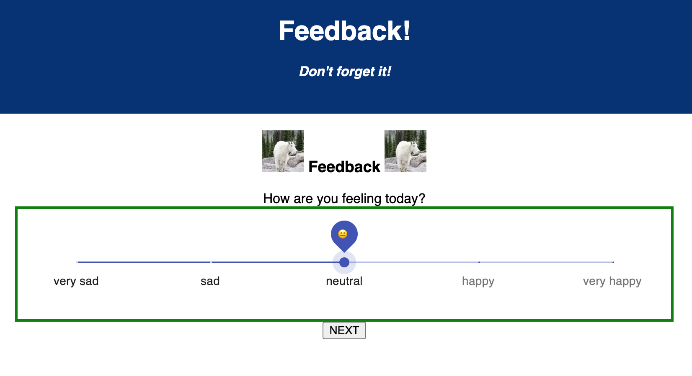

# WEEKEND REDUX FEEDBACK LOOP

## Description

_Duration: week 11 weekend_

Created a feedback form linked to a database. Form uses pool for database communication and axios for communication between the server and the client. Form uses React to create a responsive UI, Redux to pass around information internally, react-router-dom to break UI into multiple screens, useHistory from react router dom to navigate between screens, and material-ui for styling.

SCREAMING_SNAKE_CASE

## Screen Shot

### Prerequisites

Link to software that is required to install the app (e.g. node).

- [Node.js](https://nodejs.org/en/)
- List other prerequisites here

## Installation

How do you get your application up and running? This is a step by step list for how another developer could get this project up and running. The good target audience in terms of knowledge, would be a fellow Primer from another cohort being able to spin up this project. Note that you do not need a paragraph here to intro Installation. It should be step-by-step.

If your application has secret keys (for example --  Twilio), make sure you tell them how to set that up, both in getting the key and then what to call it in the `.env` file.

1. Create a database named `your database name`,
2. The queries in the `tables.sql` file are set up to create all the necessary tables and populate the needed data to allow the application to run correctly. The project is built on [Postgres](https://www.postgresql.org/download/), so you will need to make sure to have that installed. We recommend using Postico to run those queries as that was used to create the queries, 
3. Open up your editor of choice and run an `npm install`
4. Run `npm run server` in your terminal
5. Run `npm run client` in your terminal
6. The `npm run client` command will open up a new browser tab for you!

## Usage
How does someone use this application? Tell a user story here.

1. xxx
2. xxx
3. xxx
4. xxx
5. xxx
6. xxx

## Built With

List technologies and frameworks here

## License
[MIT](https://choosealicense.com/licenses/mit/)

_Note, include this only if you have a license file. GitHub will generate one for you if you want!_

## Acknowledgement
Thanks to [Prime Digital Academy](www.primeacademy.io) who equipped and helped me to make this application a reality. (Thank your people)

## Support
If you have suggestions or issues, please email me at [youremail@whatever.com](www.google.com)